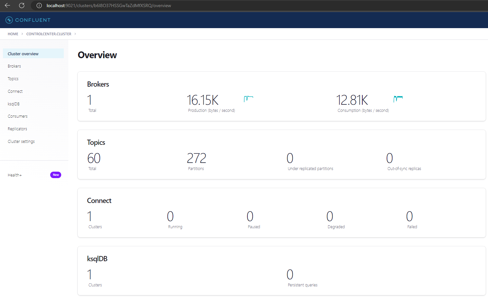

# Run and test Apache Kafka

Download the Confluent Platform binaries as Docker [image](https://developer.confluent.io/quickstart/kafka-docker/)

## Starting Confluent Platform stack

Considerations

+ Potentially longer download time, up to several minutes
+ Fewest steps to install and start
+ Requires ```docker``` and ```docker-compose```
+ Uninstall with ```docker system prune -a```


How to spin up?

```
docker compose -f docker-compose.yml up -d
```
Each Confluent Platform component starts in a separate container.

```
[+] Running 10/10
 - Network volpay_default     Created                                                                                                 0.2s
 - Container zookeeper        Started                                                                                                 3.5s
 - Container broker           Started                                                                                                 4.0s
 - Container schema-registry  Started                                                                                                 5.5s
 - Container rest-proxy       Started                                                                                                 7.3s
 - Container connect          Started                                                                                                 7.1s
 - Container ksqldb-server    Started                                                                                                 8.6s
 - Container control-center   Started                                                                                                11.5s
 - Container ksqldb-cli       Started                                                                                                11.8s
 - Container ksql-datagen     Started                                                                                                11.1s
 ```

 Verify that the services are up and running:

 ```
 docker compose ls
 ```
 and/or

 ```
 docker container ls -a
 ```
```
CONTAINER ID   IMAGE                                             COMMAND                  CREATED          STATUS          PORTS                                            NAMES
f6967c9c6f58   confluentinc/cp-ksqldb-cli:7.3.1                  "/bin/sh"                47 minutes ago   Up 47 minutes                                                    ksqldb-cli
9128eccee64f   confluentinc/ksqldb-examples:7.3.1                "bash -c 'echo Waiti…"   47 minutes ago   Up 47 minutes                                                    ksql-datagen
8105a97d5902   confluentinc/cp-enterprise-control-center:7.3.1   "/etc/confluent/dock…"   47 minutes ago   Up 47 minutes   0.0.0.0:9021->9021/tcp                           control-center
5ccc58d83bb3   confluentinc/cp-ksqldb-server:7.3.1               "/etc/confluent/dock…"   47 minutes ago   Up 47 minutes   0.0.0.0:8088->8088/tcp                           ksqldb-server
1c3440f6fd87   confluentinc/cp-kafka-rest:7.3.1                  "/etc/confluent/dock…"   47 minutes ago   Up 47 minutes   0.0.0.0:8082->8082/tcp                           rest-proxy
6e93b6799d67   cnfldemos/cp-server-connect-datagen:0.5.3-7.1.0   "/etc/confluent/dock…"   47 minutes ago   Up 47 minutes   0.0.0.0:8083->8083/tcp, 9092/tcp                 connect
60f45337b3ae   confluentinc/cp-schema-registry:7.3.1             "/etc/confluent/dock…"   47 minutes ago   Up 47 minutes   0.0.0.0:8081->8081/tcp                           schema-registry
bb1a7ed09bb5   confluentinc/cp-server:7.3.1                      "/etc/confluent/dock…"   47 minutes ago   Up 47 minutes   0.0.0.0:9092->9092/tcp, 0.0.0.0:9101->9101/tcp   broker
a084b9c765ee   confluentinc/cp-zookeeper:7.3.1                   "/etc/confluent/dock…"   47 minutes ago   Up 47 minutes   2888/tcp, 0.0.0.0:2181->2181/tcp, 3888/tcp       zookeeper
```

## Use Confluent Control Center to view your cluster

To inspect and manage your cluster, open a web browser to ```http://localhost:9021/```. You’ll see the ```“Clusters”``` page, which shows your running ```Kafka cluster``` and the attached ```Kafka Connect``` and ```ksqlDB``` clusters.


Click the ```controlcenter.cluster``` tile to inspect your local installation. The ```“Cluster Overview”``` page opens. This page shows vital metrics, like production and consumption rates, out-of-sync replicas, and under-replicated partitions.



From the navigation menu in the left pane, you can view various parts of your Confluent installation.

## Destroy the Kafka cluster

```
docker compose stop
```

```
docker compose -f docker-compose.yml down
```
